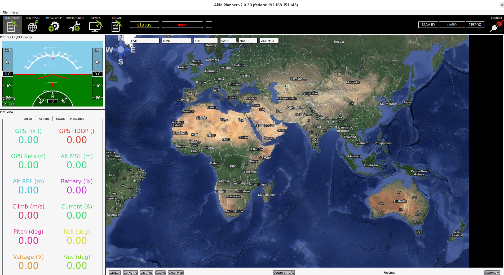

APM Planner 2.0
===============

**Travis CI Build:**  [](https://travis-ci.org/ArduPilot/apm_planner)

**Support:**
[ardupilot.com Support Forum for APM Planner 2.0](https://discuss.ardupilot.org/c/ground-control-software/apm-planner-2-0/)

Support is handled in the forum, we keep issues here known problems and enhancements

**Developer Chat:** https://gitter.im/diydrones/apm_planner

[](https://gitter.im/diydrones/apm_planner?utm_source=badge&utm_medium=badge&utm_campaign=pr-badge&utm_content=badge)

**Credits:**
https://ardupilot.org/planner2/docs/credits-and-contributors.html

[Waffle.io](https://waffle.io/diydrones/apm_planner) Progress Graph

[](https://waffle.io/diydrones/apm_planner/metrics)

Documentation
=============
see https://ardupilot.org/planner2/


Linux 
=====

Build APM Planner on Fedora 36
--------------------
```bash
docker run --rm -it -v ./:/apm_planner hexaforce/apm_planner_builder
```

Run APM Planner on Fedora 40
--------------------
```bash
sudo dnf install qt5-qtbase qt5-qtserialport

./release/apmplanner2
```
```bash
# If there are any missing libraries, install them.
ldd release/apmplanner2
```


